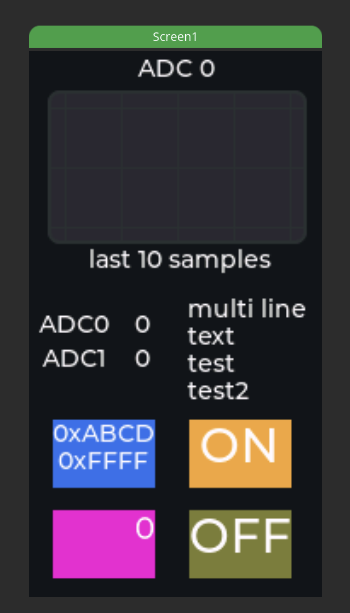
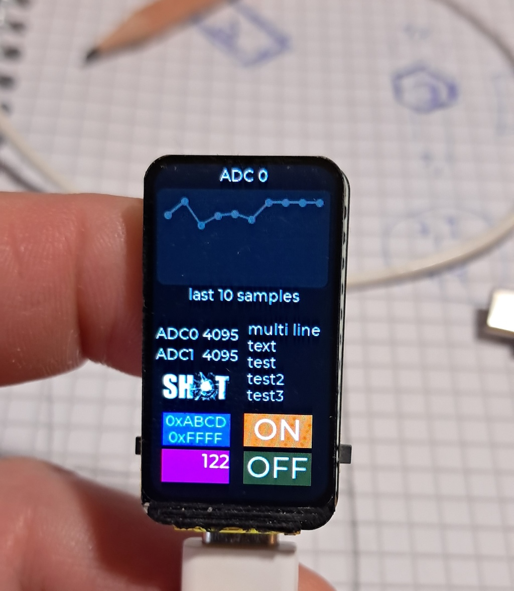

# esp32-lcd
Example code for UI on ESP32 with lcd display using ESP-IDF and
Squareline Studio. So far this has only been tested on macOS.

This instruction pertains to the ESP32-C6-lcd-1.47 board.

The software is based on the <a href="https://files.waveshare.com/wiki/ESP32-C6-LCD-1.47/ESP32-C6-LCD-1.47-Demo.zip"> demo files </a> found on the <a href="https://www.waveshare.com/wiki/ESP32-C6-LCD-1.47">ESP32-C6-LCD-1.47</a> Wiki.

Unfortunately the files didn't work as expected when using Squareline Studio and working
in the ESP-IDF environment (I didn't test the Arduino builds). So some modifications were
needed.

# Prerequisites

Install ESP-IDF - this was installed via VS Code as far as I recall

Install LVGL library - also installed via VS Code

Install SquareLine Studio - download and install

# Adjustments

## Squareline Studio
None of the board templates I could choose suppoerted the correct 
resolution for my board (172 x 320 pixels in portrait mode 320 x 172 in landscape).

I had to create a custom board support file for my board in 

~/SquareLine/boards/Espressif/board

I used esp32_s2_kaluga_kit_v1_0_0 as a template as it nearly worked.

So I made a copy and renamed the files correspondingly. Then I changed 
the resolution, title and swap ("color_depth": "16 sw"). I should probably have updated the URL and descriptions but couldn't be bothered.

    {
        "version": "1.0.0",
        "group": "Espressif",
        "title": "ESP32-C6_LCD-MJC",
        "width": 172,
        "height": 320,
        "width_min": 172,
        "height_min": 320,
        "width_max": 172,
        "height_max": 320,
        "offset_x": 0,
        "offset_y": 0,
        "rotation": 90,
        "shape": "",
        "color_depth": "16",
        "lvgl_export_path": "",
        "lvgl_include_path": "lvgl.h",
        "language": "C",
        "supported_lvgl_version": "8.2.0, 8.3.*",
        "pattern_match_files": "./CMakeLists.txt",
        "ui_export_path": "./main/ui",
        "flat_export": false,
        "url": "https://github.com/espressif/esp-bsp",
        "short_description": "The ESP32-S2-Kaluga-1 development kit produced by Espressif. It integrates the ESP32-S2-WROVER module and all the connectors for extension boards.",
        "long_description": "Multimedia development board ESP32-S2-Kaluga-1 kit based on ESP32-S2 has various functions, such as an LCD screen display, touch panel control, camera image acquisition, audio playback, etc. It can be flexibly assembled and disassembled, thus fulfilling a variety of customized requirements.",
        "repository": "https://boards.squareline.io/esp32_s2_kaluga_kit_v1_0_0",
        "custom_params": []
    }

## LVGL
The LVGL library had to be slightly modified to support landscape mode for the LCD.

The two files modified were: **st7789.h** where the following code was added

        #define MJC_ROTATE 1
        #if MJC_ROTATE == 1
            #define EXAMPLE_LCD_H_RES              320
            #define EXAMPLE_LCD_V_RES              172
            #define Offset_X 0       
            #define Offset_Y 34
        #else
            #define EXAMPLE_LCD_H_RES              172
            #define EXAMPLE_LCD_V_RES              320
            #define Offset_X 34
            #define Offset_Y 0
        #endif

I have no idea why the code needs an x-offset of 34 pixels...

I also added this to **LVGL_Driver.c**:

        #if MJC_ROTATE == 1
            // Rotate LCD display
            esp_lcd_panel_swap_xy(panel_handle, true);
            esp_lcd_panel_mirror(panel_handle, true, true);
        #endif

# Build

The follwing commands will setup the build environment, configure the build project, build and flash the resulting binaries.

    > cd first_lcd
    > source scripts/init
    > ./scripts/target
    > ./scripts/build
    > ./scripts/flash

From then on you only need to build and flash which can be done in one go:

    > ./scripts/build && ./scripts/flash

If you need to tweak the system behaviour by enabling or disabling parameters in 
**sdkconfig.defaults** you will need to run the target script again.

# UIs
## first_lcd
The UI as defined in Squareline Studio (files in **UI** folder)

But this is subject to change without notice as the project unfolds.

